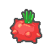

# Arcade

*If you are looking for a guide on the interface or on how to implement games/graphical libraries, go to ./doc/arcade_guide.md*

## Description

Arcade is a project that aims to create a gaming platform that allows the user to choose between different games and graphical libraries. The user can switch between games and libraries at runtime.

## Authors
We (Stereo Madness) chose to work with the following groups:

- **CodinBox**:
  - yanis.zeghiche (group leader)
  - adam.brutsaert
- **Hors cadre**:
  - merlin.cyffers (group leader)
  - adam.cavillon
  - alexandre.barberis
- **Stereo Madness**:
  - leo.dumont (group leader)
  - elliot.alladaye
  - thibault.longuepee

We have the same interfaces and our games and graphical libraries are compatible with each other.

## How to use

Do `make` to compile the project, then run `./arcade ./lib/lib_arcade_sfml.so` to start the program with the SFML graphical library (or any other library). You can then switch between games and libraries at runtime.

Press `TAB` to modify you username, the maximum username length is 10 characters.
Press `TAB` an other time to leave username modification.

Press `I`, `K` to select the game you want to play.
Press `J`, `L` to select the graphical library you want to use.

Pressing `ESCAPE` in any game will make you come back into the menu, and you can close the menu by pressing `ESCAPE`.

## Our games

To switch game, press `ESCAPE` will move you back to the menu.

### Snake

Use `Z`, `Q`, `S`, `D` to move the snake.

Try to eat as many candies as possible to increase your score will avoiding the walls and the snake's body.

Consumables:
-  **Super-Candy**:  Increases the snake's size by 1 and is worth 10 score points. It has the side effect of increasing the snake's speed, be careful!
-  **Aguav Berry**: Decreases the snake's size by 1 and is worth -5 score points (It's worth it!).
-  **Tamato Berry**: Resets the snake's speed, but is worth -5 score points (It's also worth it!).

Berries may appear after eating a super-candy but only one of each type can be present at a time.

### Pacman

Use `Z`, `Q`, `S`, `D` to move Pacman.

Try to eat as many dots as possible to increase your score while avoiding the ghosts.
Eating a big dot will allow you to eat the ghosts for 10 seconds.
Eating all dots (including big dots) will make you win, and will spawn you into a new map!
Ghosts will reappear after getting back to the base.
You can cross borders, it will teleport you to the otherside.
You can also pause the game by pressing `P`, press it back to come back in the game.

### Nibbler

Use `Z`, `Q`, `S`, `D` to move the nibbler.

Try to eat as many candies as possible to increase your score will avoiding the nibbler's body.

Consumables:
-  **Super-Candy**:  Increases the snake's size by 1 and is worth 10 score points. It has the side effect of increasing the snake's speed, be careful!

After succefully eating all the super-candies on the map, the nibbler will shrink to its original size and a new map will be appear, try to get the highest score possible!

## Our Graphical Libraries

To switch graphical libraries, use the `J` and `L` keys.

### SFML

### Ncurses

### SDL2

