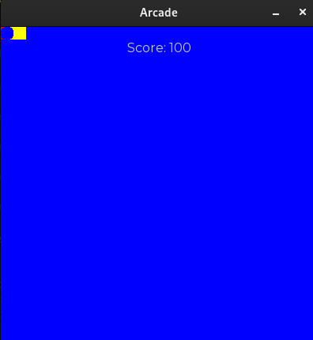

# Arcade Guide

## Preface

The **Arcade** is a second-year project at Epitech aimed at creating a **gaming platform**.

This involves creating multiple games that are compatible with **various graphical or textual libraries**, while allowing for **dynamic switching** between these games and graphical libraries without the need to restart the program. Furthermore, collaborative efforts with other groups are necessary to ensure that the games and graphical libraries they develop are **mutually compatible**.

The central component responsible for managing both games and libraries is referred to as the **Core**.

This guide is divided into 2 parts:
- *Interface Sharing* where we'll detail our common interfaces
- *How to Guides* where we'll explain how to create your own games and graphical libraries compatible with our Arcade.

## Interface Sharing

To ensure compatibility among games and libraries, groups must share **common interfaces** that establish the architecture for their respective games and graphical libraries. Thus, they must develop abstract classes, serving as a basis, which concrete classes can inherit from. It is imperative that groups adhere to these interfaces when constructing their libraries to ensure seamless compatibility with those developed by other groups.

In our case, all of our shared interfaces are within the `arc` namespace.

### IGame

The `IGame` interface is the foundation for all games. It encompasses all the required methods that will be called by the Core to interact with.

When creating a new game, this is the only class that needs to be implemented. More information on how to create a game in the *How to create your own game* section.

```cpp
/**
 * @brief Represents a game that is exported by a shared library.
 */
class IGame {
public:
    virtual ~IGame() = default;

    /**
     * @brief Called once when the game is created. It should be used to
     *        load the textures.
     * @param lib the current library
     */
    virtual void initialize(ILibrary& lib) = 0;

    //? No need for deinitalize, the destructor will do the job

    /**
     * @brief Called when a key is pressed
     * @param event the event
     */
    virtual void onKeyPressed(ILibrary& lib, Key key) = 0;

    /**
     * @brief Called when a mouse button is pressed
     * @param event the event
     */
    virtual void onMouseButtonPressed(ILibrary& lib, MouseButton button, int32_t x, int32_t y) = 0;

    /**
     * @brief Updates the game. It should be used to update the game state.
     *
     * @param deltaTime the time since the last update
     */
    virtual void update(ILibrary& lib, float deltaTime) = 0;

    /**
     * @brief This function is called to draw the game. It should be used
     *        to draw based on the current game state and not do any logic.
     * @param lib the current library
     */
    virtual void draw(ILibrary& lib) = 0;

    /**
     * @brief This function is called to get current score of the game.
     *        It should be used in the core to handle the highscore mechanism.
     */
    virtual uint64_t score() const = 0;
};
```

### ILibrary

Likewise, the `ILibrary` interface is the foundation for all graphical libraries. It is meant to provide access to the `IDisplay` interface, as well as the different managers of the graphical library.

```cpp
/**
 * @brief Represents a library that is exported by a shared library.
 */
class ILibrary {
public:
    virtual ~ILibrary() = default;

    /**
     * @brief Returns the display of the library
     *
     * @return IDisplay& The display
     */
    virtual IDisplay& display() = 0;

    /**
     * @brief Returns the texture manager of the library
     *
     * @return ITextureManager& The texture manager
     */
    virtual ITextureManager& textures() = 0;

    /**
     * @brief Returns the font manager of the library
     *
     * @return IFontManager& The font manager
     */
    virtual IFontManager& fonts() = 0;

    /**
     * @brief Returns the sound manager of the library
     *
     * @return ISoundManager& The sound manager
     */
    virtual ISoundManager& sounds() = 0;

    /**
     * @brief Returns the music manager of the library
     *
     * @return IMusicManager& The music manager
     */
    virtual IMusicManager& musics() = 0;
};
```

### IDisplay

The `IDisplay` interface represents the surface on which a game will be displayed. It is responsible for handling events, updating the display, drawing textures and printing text.

```cpp
    /**
     * @brief Represents a display. This could be a window or a terminal.
     */
    class IDisplay {
    public:
        virtual ~IDisplay() = default;

        /**
         * @brief Sets the title of the display
         *
         * @param title the title of the display
         */
        virtual void setTitle(const std::string& title) = 0;

        /**
         * @brief Sets the max framerate of the display
         *
         * @param framerate the limit framerate
         */
        virtual void setFramerate(uint32_t framerate) = 0;

        /**
         * @brief Sets the size of a single tile
         *
         * @param size the size of a single tile
         */
        virtual void setTileSize(std::size_t size) = 0;

        /**
         * @brief Sets the number of tiles per row
         *
         * @param width the number of tiles per row
         */
        virtual void setWidth(std::size_t width) = 0;

        /**
         * @brief Sets the number of tiles per column
         *
         * @param height the number of tiles per column
         */
        virtual void setHeight(std::size_t height) = 0;

        /**
         * @brief Returns the title of the display
         *
         * @return std::string The title
         */
        virtual std::string title() const = 0;

        /**
         * @brief Returns the framerate limit of the display
         *
         * @return uint32_t The framerate limit
         */
        virtual uint32_t framerate() const = 0;

        /**
         * @brief Returns the size of tiles
         *
         * @return std::size_t The size of tiles
         */
        virtual std::size_t tileSize() const = 0;

        /**
         * @brief Returns the number of columns of the display
         *
         * @return std::size_t the number of columns
         */
        virtual std::size_t width() const = 0;

        /**
         * @brief Returns the number of rows of the display
         *
         * @return std::size_t the number of rows
         */
        virtual std::size_t height() const = 0;

        /**
         * @brief Returns whether the display is opened
         *
         * @return true if the display is opened
         * @return false if the display is closed
         */
        virtual bool opened() const = 0;

        /**
         * @brief Closes the display
         */
        virtual void close() = 0;

        /**
         * @brief Poll events
         *
         * @param event the event to fill
         * @return true if there was an event
         * @return false if there was no event
         */
        virtual bool pollEvent(Event& event) = 0;

        /**
         * @brief Updates the display. For instance, this could be used poll
         *        events or compute frame rate.
         */
        virtual void update(float deltaTime) = 0;

        /**
         * @brief Clears the display
         *
         * @param color the color to clear the display with
         */
        virtual void clear(Color color = {0, 0, 0, 255}) = 0;

        /**
         * @brief Draws a texture to the display
         *
         * @param texture the texture to draw
         * @param x the column to draw the texture at
         * @param y the row to draw the texture at
         */
        virtual void draw(std::shared_ptr<ITexture> texture, float x, float y) = 0;

        /**
         * @brief Draws a string to the display
         *
         * @param string the string to draw
         * @param font the font to use
         * @param x the column to draw the texture at
         * @param y the row to draw the texture at
         */
        virtual void print(const std::string& string, std::shared_ptr<IFont> font, float x, float y) = 0;

        /**
         * @brief Returns the size of a string when printed
         *
         * @param string the string to measure
         * @param font the font to use
         * @return Rect the size of the string when printed
         */
        virtual Rect<float> measure(const std::string& string, std::shared_ptr<IFont> font, float x, float y) = 0;

        /**
         * @brief Flushes what has been drawn to the display.
         */
        virtual void flush() = 0;
    };
```

### Managers

The manager interfaces are used to supervise the diverse resources within a graphical library, handling tasks such as loading and retrieving textures, fonts, sounds and musics. They ensure efficient tracking of resources, including preventing redundant loading of the same resource.

The various managers modules adhere to the same logic:

- They have a *Specification* structure, which represents the resource to be loaded.

- They have a *Resource* class to represent the loaded resource.

- They have a *Manager* class to manage resources, offering functionalities such as `load`, `get` and `dump`.

#### ITextureManager

```cpp
/**
 * @brief Represents the specification required to create a textual texture
 */
struct TextureTextualSpecification {
    char character;
    Color color;
};

/**
 * @brief Represents an image for a texture
 */
struct TextureImage {
    std::string path;
    std::optional<Rect<uint32_t>> subrect = std::nullopt;
};

/**
 * @brief Represents the specification required to create a graphical texture
 */
using TextureGraphicalSpecification = std::variant<TextureImage, Color>;

/**
 * @brief Represents the specification required to create a texture
 */
struct TextureSpecification {
    TextureTextualSpecification textual;
    TextureGraphicalSpecification graphical;
};

/**
 * @brief Represents a texture
 */
class ITexture {
public:
    virtual ~ITexture() = default;

    /**
     * @brief Returns the specification required to create the texture
     *
     * @return const TextureSpecification& The specification required to create the texture
     */
    virtual const TextureSpecification& specification() const = 0;
};

/**
 * @brief Represents a texture manager
 */
class ITextureManager {
public:
    virtual ~ITextureManager() = default;

    /**
     * @brief Loads a texture
     *
     * @param name the name of the texture
     * @param specification the specification required to create the texture
     * @return true if the texture has been loaded
     * @return false if the texture failed to load
     */
    virtual bool load(const std::string& name, const TextureSpecification& specification) = 0;

    /**
     * @brief Retrieves a texture
     *
     * @param name the name of the texture
     * @return ITexture& the texture
     */
    virtual std::shared_ptr<ITexture> get(const std::string& name) = 0;

    /**
     * @brief Retrieves all the textures specifications with their name
     *
     * @return std::vector<TextureSpecification> the specifications of all the textures
     */
    virtual std::map<std::string, TextureSpecification> dump() const = 0;
};
```

#### IFontManager

```cpp
/**
 * @brief Represents the specification required to create a Font
 */
struct FontSpecification {
    arc::Color color;
    std::size_t size;
    std::string path;
};

/**
 * @brief Represents a font
 */
class IFont {
public:
        ~IFont() = default;

    /**
     * @brief Returns the specification of the font
     *
     * @return const FontSpecification& The specification of the font
     */
    virtual const FontSpecification& specification() const = 0;
};

/**
 * @brief Represents the font manager
 */
class IFontManager {
public:
    ~IFontManager() = default;

    /**
     * @brief Loads a font from a specification
     *
     * @param name the name of the font
     * @param spec the specification of the font
     * @return true if the font was loaded successfully
     * @return false if the font could not be loaded
     */
    virtual bool load(const std::string& name, const FontSpecification& spec) = 0;

    /**
     * @brief Retrieves a fon
     *
     * @param name the name of font
     * @return IFont& the font
     */
    virtual std::shared_ptr<IFont> get(const std::string &name) = 0;

    /**
     * @brief Retrieves all the fonts specifications with their name
     *
     * @return std::vector<TextureSpecification> the specifications of all the textures
     */
    virtual std::map<std::string, FontSpecification> dump() const = 0;
};
```

#### ISoundManager

```cpp
/**
 * @brief Represents the specification required to create a sound
 */
struct SoundSpecification {
    std::string path;
};

/**
 * @brief Represents a sound
 */
class ISound {
public:
    virtual ~ISound() = default;

    /**
     * @brief Returns the specification required to create the sound
     *
     * @return const SoundSpecification& The specification required to create the sound
     */
    virtual const SoundSpecification& specification() const = 0;
};

/**
 * @brief Represents a sound manager
 */
class ISoundManager {
public:
    virtual ~ISoundManager() = default;

    /**
     * @brief Loads a sound
     *
     * @param name the name of the sound
     * @param specification the specification required to create the sound
     * @return true if the sound has been loaded
     * @return false if the sound failed to load
     */
    virtual bool load(const std::string& name, const SoundSpecification& specification) = 0;

    /**
     * @brief Retrieves all the sounds specifications with their name
     *
     * @return std::vector<SoundSpecification> the specifications of all the sounds
     */
    virtual std::map<std::string, SoundSpecification> dump() const = 0;

    /**
     * @brief Plays a sound
     *
     * @param name the name of the sound
     */
    virtual void play(const std::string& name, const float volume) = 0;

    /**
     * @brief Stops a sound
     *
     * @param name the name of the sound
     */
    virtual void stop(const std::string& name) = 0;
};
```

#### IMusicManager

*The difference between sounds and musics in an user perspective is that sounds cannot be paused nor looped while musics can.*

*The difference between sounds and musics in an implementation perspective is that sounds are loaded in memory and played when needed while musics are streamed from the disk and played.*

```cpp
/**
 * @brief Represents the specification required to create a music
 */
struct MusicSpecification {
    std::string path;
    bool loop;
    float startOffset = 0;
    bool isPlaying = false;
};

/**
 * @brief Represents a music
 */
class IMusic {
public:
    virtual ~IMusic() = default;

    /**
     * @brief Returns the specification required to create the music
     *
     * @return const MusicSpecification& The specification required to create the music
     */
    virtual const MusicSpecification& specification() const = 0;
};

/**
 * @brief Represents a music manager
 */
class IMusicManager {
public:
    virtual ~IMusicManager() = default;

    /**
     * @brief Loads a music
     *
     * @param name the name of the music
     * @param specification the specification required to create the music
     * @return true if the music has been loaded
     * @return false if the music failed to load
     */
    virtual bool load(const std::string& name, const MusicSpecification& specification) = 0;

    /**
     * @brief Retrieves all the musics specifications with their name
     *
     * @return std::vector<MusicSpecification> the specifications of all the musics
     */
    virtual std::map<std::string, MusicSpecification> dump() const = 0;

    /**
     * @brief Plays a music
     *
     * @param name the name of the music
     */
    virtual void play(const std::string& name, const float volume) = 0;

    /**
     * @brief Stops a music
     *
     * @param name the name of the music
     */
    virtual void stop(const std::string& name) = 0;

    /**
     * @brief get whether the music is playing
     *
     * @param name the name of the music
     */
    virtual bool isPlaying(const std::string& name) = 0;
};
```

### Miscellaneous

The following code are not interfaces but instead are enums and structs required in the aforementioned interfaces or for general usage.

```cpp
/**
 * @brief Represents a color
 */
struct Color {
    uint8_t red;
    uint8_t green;
    uint8_t blue;
    uint8_t alpha;
};

/**
 * @brief Represents a rectangle
 */
template<typename T>
struct Rect {
    T x;
    T y;
    T width;
    T height;
};

enum class SharedLibraryType {
    LIBRARY = 0,
    GAME,
};
```

## How to Guides

Now that we have taken a look at the interfaces, let's see how to use them to create your own games and graphical libraries step by step.

#### Requirements

- g++ version 12.2.1 or higher
- GNU Make
- Any graphical library that you want to enwrap (e.g. SFML, SDL2, NCurses)

### How to create your own game

For the sake of this example we will try to implement a game with basic rules:
- The player is a square that can move in 4 directions
- The player can collect items that are randomly placed on the map and increase his score
- The player can't go out of the screen

It will include textures, fonts, music and sounds. After following this guide you should be able to create your own game with your own rules.

#### Step 0: Creating files and compilation

Create a `MyGame.cpp` file.

Compile the game with the following command:
`g++ -shared MyGame.cpp -o arcade_mygame.so -fPIC -iquote ./include -std=c++20 -Wall -Wextra -Werror`
*Of course if will not work for now because you don't have code in MyGame.cpp yet*

This command creates a arcade_mygame.so shared library that will be loaded by the Core.
Simply run the Core with the shared library and a graphical library (`arcade_ncurses.so`, `arcade_sfml.so` ect)to see the result.

#### Step 1: Create the game class that inherits from IGame

```cpp
#include <IGame.hpp>

class MyGame : public arc::IGame {
    public:
        virtual void initialize(arc::ILibrary& lib)
        {
        }

        virtual void onKeyPressed(arc::ILibrary& lib, arc::Key key)
        {
        }

        virtual void onMouseButtonPressed(arc::ILibrary& lib, arc::MouseButton button, int32_t x, int32_t y)
        {
        }

        virtual void update(arc::ILibrary& lib, float deltaTime)
        {
        }

        virtual void draw(arc::ILibrary& lib)
        {
        }

        virtual uint64_t score() const
        {
            return 0;
        }

    private:
        // Any variables or functions that are only relevant to this game
}
```

*For now, we will have this class and all the game code in a single in a `.cpp` file, for doing an actual game, you may want to have `.hpp` files with the classes declarations and `.cpp` files with the implementations.*

For this step, we override all the functions of the IGame interface. We will implement them in the next steps.

#### Step 2: Define extern "C" functions

An extern "C" function is a function that is compiled in C style. This is useful when you want to export functions from a shared library. We will define 3 functions:
- `entrypoint`: This function will be called by the Core to create the game, returns a `new MyGame` object
- `type`: This function will be called by the Core to get the type of the shared library (`arc::SharedLibraryType::GAME` for a game, `arc::SharedLibraryType::LIBRARY` for a graphical library)
- `name`: This function will be called by the Core to get the name of the shared library, simply return a string with the name of your game

```cpp
#include "arcade/SharedLibraryType.hpp"
// class implementation ...

extern "C" arc::IGame* entrypoint()
{
    return new MyGame;
}

extern "C" arc::SharedLibraryType type()
{
    return arc::SharedLibraryType::GAME;
}

extern "C" const char *name()
{
    return "MyGame";
}
```

#### Step 3: Initialize the display

```cpp
// class implementation ...
virtual void initialize(arc::ILibrary& lib)
{
    lib.display().setTitle("Arcade"); // This name will appear in the window title
    lib.display().setFramerate(30); // The game will run at 30 fps
    lib.display().setTileSize(16); // The size of the tiles in pixels
    lib.display().setWidth(25); // The number of tiles per row
    lib.display().setHeight(25); // The number of tiles per column
}
// rest of the class implementation ...
```

In the `initialize` function, we first set the title, the framerate, the size of the tiles and the number of tiles per row and column.

#### Step 4: Load the textures

Here we will load the differents ressources into our graphical library's managers.

```cpp
// class implementation ...
virtual void initialize(arc::ILibrary& lib)
{
    // ...

    // Textures
    arc::TextureSpecification spec;
    spec.textual.character = '#'; // The character that will be used to draw the texture when using a textual display (ex: ncurses)
    spec.textual.color = {255, 0, 0, 255}; // The color of the said character
    spec.graphical = arc::TextureImage {
        "tileset.png", // The path to the image
        arc::Rect<uint32_t>{0, 0, 16, 16} // The subrect of the image to use (optional)
    };
    lib.textures().load("player", spec); // Loading this texture specification to the textures manager, with a name to retrieve it later

    spec.textual.character = 'O';
    spec.textual.color = {255, 255, 0, 255};
    spec.graphical = arc::Color{255, 255, 0, 255 }; // the `graphical` variant can also be a color
    lib.textures().load("goal", spec);

    // Fonts
    arc::FontSpecification text {
        .color = arc::Color {200, 200, 200, 255},
        .size = 16,
        .path = "regular.ttf"
    };
    lib.fonts().load("font", text); // Works the same way as the textures

    // Sounds
    arc::SoundSpecification sound;
    sound.path = "woosh.wav";
    lib.sounds().load("woosh", sound); // Works the same way as the textures

    // Musics
    arc::MusicSpecification music;
    music.path = "pacman-theme.wav";
    music.loop = true; // The music will loop
    music.isPlaying = false; // The music is not playing at the start of the game
    lib.musics().load("pacman-theme", music); // Works the same way as the textures
    // rest of the initialization ...
}
// rest of the class implementation ...
```

Overall, think of the initialization as a way to load all the resources that you will need in your game, loading them elsewhere will result in having to load them every frame which is not optimal. It is also a great way to initialize the game state, more on that in the next steps.

#### Step 5: Draw the game

After this step, you will be able to see the game on the screen.

```cpp
// class implementation ...
virtual void draw(arc::ILibrary& lib)
{
    std::stringstream score;

    score << "Score: " << 0;

    lib.display().clear(arc::Color{0, 0, 255, 0}); // Clear the display with a blue color
    lib.display().draw(lib.textures().get("player"), 0, 0); // Draw the player texture at the top left corner of the screen
    lib.display().draw(lib.textures().get("goal"), 1, 0); // Draw the goal texture just next to the player

    auto width = lib.display().width();
    auto textWidth = lib.display().measure(score.str(), lib.fonts().get("font"), 0, 0).width; // Here we use the measure function to get the width of the text
    auto center = (width - textWidth) / 2;

    lib.display().print(score.str(), lib.fonts().get("font"), center, 1); // Print the score at the top of the screen
    lib.display().flush(); // Flush the display to actually draw everything
}
// rest of the class implementation ...
```

Try the command that is used to compile the game again, and run the Core with your game and a graphical library to see the result.
*If you have 'unused parameter' warnings, try adding `[[maybe_unused]]` before the parameter*

Your game should look something like this:


#### Step 6: Adding variables to the game

First we will add a few variables to the class to keep track of the player's position, the goal's position and the score.

```cpp
struct vec2 {
    int x;
    int y;
};
// class implementation ...
private:
    float _elapsed = 0;
    uint32_t _score = 0;
    vec2 _playerDir = {0, 0};
    vec2 _playerPos = {0, 0};
    vec2 _goalPos = {0, 0};
```
We will also add a function that resets the coordinates of the goal.

```cpp
// class implementation ...
private:
    void resetGoal()
    {
        _goalPos.x = rand() % 25;
        _goalPos.y = rand() % 25;
    }
```

And add this line to the initialize function:

```cpp
resetGoal();
```

We can now change the score function to return the `_score` variable.

```cpp
// class implementation ...
virtual uint64_t score() const
{
    return _score;
}
```

We will also change the draw so that the player and the goal are drawn at their respective positions and so that the score is displayed depending on the `_score` variable.

```cpp
virtual void draw(arc::ILibrary& lib)
{
    std::stringstream score;

    score << "Score: " << _score; // Display the actual score

    lib.display().clear(arc::Color{0, 0, 255, 0});
    lib.display().draw(lib.textures().get("player"), _playerPos.x, _playerPos.y); // Replace the hardcoded positions with the variables
    lib.display().draw(lib.textures().get("goal"), _goalPos.x, _goalPos.y);

    auto width = lib.display().width();
    auto textWidth = lib.display().measure(score.str(), lib.fonts().get("font"), 0, 0).width;
    auto center = (width - textWidth) / 2;

    lib.display().print(score.str(), lib.fonts().get("font"), center, 1);
    lib.display().flush();
}
```

#### Step 7: Adding player movement and goal collection

To add game logic to the game, the recommended way is to add it in the `update` function. This function is called every frame and is used to update the game state.

```cpp
/// class implementation ...
virtual void update(arc::ILibrary& lib, float deltaTime)
{
    _elapsed += deltaTime;

    while (_elapsed > 0.1) { // We will update the game every 0.1 seconds, changing this value will change the game speed
        if ((_playerPos.x > 0 && _playerDir.x < 0) ||
            (_playerPos.x < 24 && _playerDir.x > 0)) // Check if the player is not out of the screen
            _playerPos.x += _playerDir.x; // Move the player in the x direction

        if ((_playerPos.y > 0 && _playerDir.y < 0) ||
            (_playerPos.y < 24 && _playerDir.y > 0)) // Check if the player is not out of the screen
            _playerPos.y += _playerDir.y; // Move the player in the y direction

        if (_playerPos.x == _goalPos.x && _playerPos.y == _goalPos.y) {
            _score += 100; // Increase the score by 100 when the player reaches the goal
            resetGoal(); // Reset the goal position
        }

        _elapsed -= 0.1;
    }
}
```

To make the game reaction to inputs, we use the `onKeyPressed` function for keyboard inputs and the `onMouseButtonPressed` function for mouse inputs. For now we will use the keyboard inputs to move the player, we will add the mouse inputs in the next step.

```cpp
virtual void onKeyPressed(arc::ILibrary& lib, arc::Key key)
{
    switch (key) { // Change the player direction based on the key pressed
        case arc::Key::Z: _playerDir = {0, -1}; break;
        case arc::Key::Q: _playerDir = {-1, 0}; break;
        case arc::Key::S: _playerDir = {0, 1}; break;
        case arc::Key::D: _playerDir = {1, 0}; break;
        default: break;
    }
}
```

You can now compile the game again and run it with the Core to see the result. You should be able to move the player and collect the goal which will increase your score and display it on the screen.

#### Step 8: Adding Sounds and Music

Let's make it so when the player changes direction, a sound is played. To do so we will use the 'woosh' sound that we loaded earlier.

```cpp
virtual void onKeyPressed(arc::ILibrary& lib, arc::Key key)
{
    switch (key) {
        case arc::Key::Z:
            _playerDir = {0, -1};
            lib.sounds().play("woosh", 50.0f); // Play the 'woosh' sound at 50% volume
            break;
        case arc::Key::Q:
            _playerDir = {-1, 0};
            lib.sounds().play("woosh", 50.0f);
            break;
        case arc::Key::S:
            _playerDir = {0, 1};
            lib.sounds().play("woosh", 50.0f);
            break;
        case arc::Key::D:
            _playerDir = {1, 0};
            lib.sounds().play("woosh", 50.0f);
            break;
        default: break;
    }
}
```

Now let's let the player control the music. The left click will now toggle the music on and off.

```cpp
virtual void onMouseButtonPressed(
    arc::ILibrary& lib,
    arc::MouseButton button,
    [[maybe_unused]] int32_t x, // The x and y parameters are not used in this example
    [[maybe_unused]] int32_t y
)
{
    if (button == arc::MouseButton::LEFT && lib.musics().isPlaying("pacman-theme"))
        lib.musics().stop("pacman-theme"); // Stop the music if it is playing
    else
        lib.musics().play("pacman-theme", 50.0f); // Play the music at 50% volume
}
```

Compile and run the game to hear the sounds and music!

**Congrats, you completed the tutorial! You can now go ahead and creates amazing games in C++ that can run on this Arcade.**

### How to create your own graphical library

For this exemple, we will implement the ncurses library which is a text based library. It will display the game in the terminal.

#### Step 0: Creating files and compilation

Create a `Ncurses.cpp` file.

Compile the library with the following command:
`g++ -shared Ncurses.cpp -o arcade_ncurses.so -fPIC -iquote ./include -std=c++20 -Wall -Wextra -Werror`
*Of course if will not work for now because you don't have code in Ncurses.cpp yet*

Similar to the game, this command creates a arcade_ncurses.so shared library that will be loaded by the Core.
Simply run the Core with the shared library and a game to see the result.

#### Step 1: Create the library class that inherits from ILibrary

```cpp
#include <ILibrary.hpp>

class NCursesLibrary : public arc::ILibrary {
public:
    NCursesLibrary() = default;
    virtual ~NCursesLibrary() = default;

    virtual arc::IDisplay& display();
    virtual arc::ITextureManager& textures();
    virtual arc::IFontManager& fonts();
    virtual arc::ISoundManager& sounds();
    virtual arc::IMusicManager& musics();

private:
};
```

We will have 9 more classes to implement:
- `NCursesTexture`: Represents a texture
- `NCursesTextureManager`: Used to load, get and dump textures
- `NCursesFont`: Represents a font
- `NCursesFontManager`: Used to load, get and dump fonts
- `NCursesSound`: Represents a sound
- `NCursesSoundManager`: Used to load, get and dump sounds
- `NCursesMusic`: Represents a music
- `NCursesMusicManager`: Used to load, get and dump musics
- `NCursesDisplay`: Responsible for displaying the game, handling events and updating the display

We will implement the classes in the next steps.

#### Step 2: Define extern "C" functions

An extern "C" function is a function that is compiled in C style. This is useful when you want to export functions from a shared library. We will define 3 functions:
- `entrypoint`: This function will be called by the Core to create the game, returns a `new NCursesLibrary` object
- `type`: This function will be called by the Core to get the type of the shared library (`arc::SharedLibraryType::GAME` for a game, `arc::SharedLibraryType::LIBRARY` for a graphical library)
- `name`: This function will be called by the Core to get the name of the shared library, simply return a string with the name of your graphical library

```cpp
//class implementation ...

extern "C" arc::ILibrary *entrypoint()
{
    return new NCursesLibrary;
}

extern "C" arc::SharedLibraryType type()
{
    return arc::SharedLibraryType::LIBRARY;
}

extern "C" const char *name()
{
    return "NCurses";
}
```

#### Step 3: Implement the NCursesTexture, NCursesFont, NCursesSound and NCursesMusic classes

Those classes are very similar so we will implement them all at once.

```cpp
#include "arcade/SharedLibraryType.hpp"

class NCursesTexture : public arc::ITexture { // Inherit from ITexture
public:
    NCursesTexture() = default; // No need to do anything in the constructor

    virtual ~NCursesTexture() = default; // No need to do anything in the destructor

    virtual void load(const arc::TextureSpecification& spec)
    {
        this->_spec = spec; // Save the specification
    }

    virtual const arc::TextureSpecification& specification() const
    {
        return this->_spec; // Return the specification
    }

    const arc::TextureTextualSpecification& characteristics() const
    {
        return this->_spec.textual; // Return the textual specification
    }

private:
    arc::TextureSpecification _spec;
};

class NCursesFont : public arc::IFont {
public:
    NCursesFont() = default;
    virtual ~NCursesFont() = default;

    virtual bool init(const arc::FontSpecification& spec)
    {
        this->_spec = spec; // Save the specification
        return true; // Return true if the font was loaded successfully, here we don't actually load the font because NCurses doesn't support fonts so we always return true
    }

    virtual const arc::FontSpecification& specification() const { return this->_spec; } // Return the specification

private:
    arc::FontSpecification _spec = {};
};

class NCursesSound : public arc::ISound {
public:
    NCursesSound() = default;
    virtual ~NCursesSound() = default;

    virtual bool init(const arc::SoundSpecification& spec)
    {
        this->_spec = spec; // Save the specification
        return true; // Return true if the sound was loaded successfully, here we don't actually load the sound because NCurses doesn't support sounds so we always return true
    }

    virtual const arc::SoundSpecification& specification() const { return this->_spec; } // Return the specification

private:
    arc::SoundSpecification _spec;
};

class NCursesMusic : public arc::IMusic {
public:
    NCursesMusic() = default;
    virtual ~NCursesMusic() = default;

    virtual bool init(const arc::MusicSpecification& spec)
    {
        this->_spec = spec; // Save the specification
        this->isPlaying = spec.isPlaying; // Set the playing state
        return true; // Return true if the music was loaded successfully, here we don't actually load the music because NCurses doesn't support musics so we always return true
    }

    virtual void play() { this->isPlaying = true; } // Sets the playing state to true
    virtual void stop() { this->isPlaying = false; } // Sets the playing state to false
    virtual bool playing() { return this->isPlaying; } // Returns the playing state
    virtual const arc::MusicSpecification& specification() const { return this->_spec; } // Return the specification

    bool isPlaying = false; // The playing state is public so we can access it from anywhere
private:
    arc::MusicSpecification _spec;
};
```

By their own, those classes don't do much, they just store the specifications of the resources and return them when asked. We will implement the managers in the next steps.

#### Step 4: Implement the NCursesTextureManager, NCursesFontManager, NCursesSoundManager and NCursesMusicManager classes

Those classes are also very similar so we will implement them all at once.

```cpp
class NCursesTextureManager : public arc::ITextureManager {
public:
    NCursesTextureManager() = default;
    virtual ~NCursesTextureManager() = default;

    virtual bool load(const std::string& name, const arc::TextureSpecification& specification)
    {
        auto texture = std::make_shared<NCursesTexture>(); // Create a new texture
        texture->load(specification); // Load the specification
        this->_textures[name] = texture; // Save the texture
        return true; // Return true if the texture was loaded successfully
    }

    virtual std::shared_ptr<arc::ITexture> get(const std::string& name)
    {
        if (this->_textures.find(name) == this->_textures.end()) // Check if the texture exists
            return nullptr; // Return nullptr if the texture doesn't exist
        return this->_textures.at(name); // Return the texture
    }

    virtual std::map<std::string, arc::TextureSpecification> dump() const
    {
        auto specs = std::map<std::string, arc::TextureSpecification>{}; // Create a map of specifications

        for (const auto& [name, texture] : this->_textures)
            specs[name] = texture->specification(); // Fill the map with the specifications

        return specs; // Return the map
    }

private:
    std::map<std::string, std::shared_ptr<NCursesTexture>> _textures;
};

// Same as the NCursesTextureManager but with fonts
class NCursesFontManager : public arc::IFontManager {
public:
    NCursesFontManager() = default;
    virtual ~NCursesFontManager() = default;

    virtual bool load(const std::string& name, const arc::FontSpecification& spec)
    {
        auto font = std::make_shared<NCursesFont>();

        if (!font->init(spec))
            return false;
        this->_fonts[name] = font;
        return true;
    }

    virtual std::shared_ptr<arc::IFont> get(const std::string &name)
    {
        if (this->_fonts.find(name) == this->_fonts.end())
            return nullptr;
        return this->_fonts.at(name);
    }

    virtual std::map<std::string, arc::FontSpecification> dump() const
    {
        auto specs = std::map<std::string, arc::FontSpecification>{};

        for (const auto& [name, font] : this->_fonts)
            specs[name] = font->specification();

        return specs;
    }

private:
    std::map<std::string, std::shared_ptr<NCursesFont>> _fonts;
};

class NCursesSoundManager : public arc::ISoundManager {
public:
    NCursesSoundManager() = default;
    virtual ~NCursesSoundManager() = default;

    virtual bool load(const std::string& name, const arc::SoundSpecification& spec)
    {
        auto attribute = NCursesSound{}; // Create a new sound

        if (!attribute.init(spec))
            return false; // Return false if the sound failed to load
        this->_sounds[name] = attribute; // Save the sound
        return true; // Return true if the sound was loaded successfully
    }

    virtual std::map<std::string, arc::SoundSpecification> dump() const
    {
        auto specs = std::map<std::string, arc::SoundSpecification>{}; // Create a map of specifications

        for (const auto& [name, sound] : this->_sounds)
            specs[name] = sound.specification(); // Fill the map with the specifications

        return specs; // Return the map
    }

    virtual void play([[maybe_unused]] const std::string& name, [[maybe_unused]] const float volume)
    {
        // Play the sound
        // Empty because NCurses doesn't support sounds
    }

    virtual void stop([[maybe_unused]] const std::string& name)
    {
        // Stop the sound
        // Empty because NCurses doesn't support sounds
    }

private:
    std::map<std::string, NCursesSound> _sounds;
};

class NCursesMusicManager : public arc::IMusicManager {
public:
    NCursesMusicManager() = default;
    virtual ~NCursesMusicManager() = default;

    // Same as the NCursesSoundManager but with musics
    virtual bool load(const std::string& name, const arc::MusicSpecification& spec)
    {
        auto attribute = NCursesMusic();

        if (!attribute.init(spec))
            return false;
        this->_musics[name] = attribute;
        return true;
    }

    virtual std::map<std::string, arc::MusicSpecification> dump() const
    {
        auto specs = std::map<std::string, arc::MusicSpecification>{}; // Create a map of specifications

        for (const auto& [name, music] : this->_musics) {
            arc::MusicSpecification spec = music.specification();
            spec.isPlaying = music.isPlaying;
            specs[name] = spec; // Fill the map with the specifications
        }

        return specs; // Return the map
    }

    virtual void play(const std::string& name, [[maybe_unused]]const float volume)
    {
        if (this->_musics.find(name) == this->_musics.end()) // Check if the music exists
            return;
        auto &attr = static_cast<NCursesMusic&>(this->_musics.at(name));
        attr.play(); // Play the music
    }

    virtual void stop(const std::string& name)
    {
        if (this->_musics.find(name) == this->_musics.end()) // Check if the music exists
            return;
        auto &attr = static_cast<NCursesMusic&>(this->_musics.at(name));
        attr.stop(); // Stop the music
    }

    virtual bool isPlaying(const std::string& name)
    {
        if (this->_musics.find(name) == this->_musics.end()) // Check if the music exists
            return false;
        auto &attr = static_cast<NCursesMusic&>(this->_musics.at(name));
        return attr.playing(); // Return the playing state
    }

private:
    std::map<std::string, NCursesMusic> _musics;
};
```

#### Step 5: Implement the NCursesDisplay class

This step has a lot of functions that only serve as getters or setters but are necessary for the Core to work.

```cpp
#include <ncurses.h>

class NCursesDisplay : public arc::IDisplay {
public:
    NCursesDisplay()
    {
        // Initialize the display
        initscr();
        cbreak();
        noecho();
        keypad(stdscr, TRUE);
        nodelay(stdscr, TRUE);

        start_color();
        if (can_change_color()) {
            _canChangeColor = true;
            init_color(COLOR_BLACK, 0, 0, 0);
            init_color(COLOR_RED, 1000, 0, 0);
            init_color(COLOR_GREEN, 0, 1000, 0);
            init_color(COLOR_YELLOW, 1000, 1000, 0);
            init_color(COLOR_BLUE, 0, 0, 1000);
            init_color(COLOR_MAGENTA, 1000, 0, 1000);
            init_color(COLOR_CYAN, 0, 1000, 1000);
            init_color(COLOR_WHITE, 1000, 1000, 1000);

            init_pair(1, COLOR_BLACK, COLOR_BLACK);
            init_pair(2, COLOR_RED, COLOR_BLACK);
            init_pair(3, COLOR_GREEN, COLOR_BLACK);
            init_pair(4, COLOR_YELLOW, COLOR_BLACK);
            init_pair(5, COLOR_BLUE, COLOR_BLACK);
            init_pair(6, COLOR_MAGENTA, COLOR_BLACK);
            init_pair(7, COLOR_CYAN, COLOR_BLACK);
            init_pair(8, COLOR_WHITE, COLOR_WHITE);
        }

        // Set the default values
        this->_title = "";
        this->_framerate = 0;
        this->_width = 80;
        this->_height = 60;
        this->_tileSize = 16;
    }

    virtual ~NCursesDisplay()
    {
        // End the display
        endwin();
    }

    virtual void setTitle(const std::string& title)
    {
        this->_title = title;
    }

    virtual void setFramerate(uint32_t framerate)
    {
        this->_framerate = framerate;
    }

    virtual void setTileSize(std::size_t size)
    {
        this->_tileSize = size;
    }

    virtual void setWidth(std::size_t width)
    {
        this->_width = width;
    }

    virtual size_t getPairColor(arc::Color color)
    {
        // Return the color pair
        if (_colorPairs.find({color.red, color.green, color.blue}) != _colorPairs.end())
            return _colorPairs[{color.red, color.green, color.blue}];
        return 1;
    }

    virtual void setHeight(std::size_t height)
    {
        this->_height = height;
    }

    virtual std::string title() const
    {
        return this->_title;
    }

    virtual uint32_t framerate() const
    {
        return this->_framerate;
    }

    virtual std::size_t tileSize() const
    {
        return this->_tileSize;
    }

    virtual std::size_t width() const
    {
        return this->_width;
    }

    virtual std::size_t height() const
    {
        return this->_height;
    }

    virtual bool opened() const
    {
        return _opened;
    }

    virtual void close()
    {
        _opened = false;
    }

    static arc::Key MapNCursesKey(char key)
    {
        // Map the ncurses key to the arcade key
        if (key >= 'a' && key <= 'z') return static_cast<arc::Key>(key - 'a');
        if (key >= 'A' && key <= 'Z') return static_cast<arc::Key>(key - 'A');
        if (key == ' ') return arc::Key::SPACE;
        return arc::Key::UNKNOWN;
    }

    virtual void update(float deltaTime)
    {
        // Handle the events
        int ch = getch();
        if (ch != ERR) {
            if (ch == 27) {
                this->close();
                return;
            }
            arc::Key key = NCursesDisplay::MapNCursesKey(ch);
            arc::Event e;
            e.type = arc::EventType::KEY_PRESSED;
            e.key = key;
            this->_events.push_back(std::move(e));
        }
        if (_framerate == 0)
            return;
        // Sleep to reach the desired framerate
        float sleeping = std::max(0.0, 1000.0 / this->_framerate - deltaTime);
        std::this_thread::sleep_for(std::chrono::milliseconds(static_cast<int>(sleeping)));
    }

    virtual bool pollEvent(arc::Event& event)
    {
        // Poll the events
        if (this->_events.empty())
            return false;

        event = this->_events.front();
        this->_events.pop_front();
        return true;
    }

    virtual void clear([[maybe_unused]] arc::Color color)
    {
        // Clear the display
        ::clear();
    }

    virtual void draw(std::shared_ptr<arc::ITexture> texture, float x, float y)
    {
        if (texture == nullptr)
            return; // Avoid segfaults

        auto& spec = std::dynamic_pointer_cast<NCursesTexture>(texture)->characteristics();

        if (_canChangeColor)
            attron(COLOR_PAIR(getPairColor(spec.color))); // Set the color
        mvaddch(y, x, spec.character); // Draw the character
        if (_canChangeColor)
            attroff(COLOR_PAIR(getPairColor(spec.color))); // Reset the color
    }

    virtual void print(const std::string& string, [[maybe_unused]] std::shared_ptr<arc::IFont> font, float x, float y)
    {
        mvprintw(y, x, "%s", string.c_str()); // Print the string
    }

    virtual arc::Rect<float> measure(const std::string& string, [[maybe_unused]] std::shared_ptr<arc::IFont> font, float x, float y)
    {
        return arc::Rect<float>{x, y, (float)string.length(), 1}; // Return the size of the string
    }

    virtual void flush()
    {
        refresh(); // Refresh the display
    }

private:
    bool _opened = true;
    std::string _title;
    uint32_t _framerate;
    std::size_t _width;
    std::size_t _height;
    std::size_t _tileSize;
    std::deque<arc::Event> _events;
    std::map<std::tuple<size_t, size_t, size_t>, int> _colorPairs = {
        {{0, 0, 0}, 1},
        {{255, 0, 0}, 2},
        {{0, 255, 0}, 3},
        {{255, 255, 0}, 4},
        {{0, 0, 255}, 5},
        {{255, 0, 255}, 6},
        {{0, 255, 255}, 7},
        {{255, 255, 255}, 8}
    };
    bool _canChangeColor = false;
};
```

#### Step 6: Change the NCursesLibrary class

Now that we have the managers, we can implement the `display`, `textures`, `fonts`, `sounds` and `musics` functions.

```cpp
class NCursesLibrary : public arc::ILibrary {
public:
    NCursesLibrary() = default;
    virtual ~NCursesLibrary() = default;

    virtual arc::IDisplay& display() { return this->_display; }
    virtual arc::ITextureManager& textures() { return this->_textures; }
    virtual arc::IFontManager& fonts() { return this->_fonts; }
    virtual arc::ISoundManager& sounds() { return this->_sounds; }
    virtual arc::IMusicManager& musics() { return this->_musics; }

private:
    NCursesDisplay _display;
    NCursesTextureManager _textures;
    NCursesFontManager _fonts;
    NCursesSoundManager _sounds;
    NCursesMusicManager _musics;
};
```

And voilà, you have now created a graphical library that can be used by the Core to display the game in the terminal.

### How to share games and libraries

To share your games and libraries with other groups, you will need to create a shared library that will be loaded by the Core. This shared library is a `.so` file, you only need this file and the assets used by the game (textures, fonts, sounds, musics) to share your game with other groups.

#### Compilation

Compile the game with the following command:
`g++ -shared $SOURCE_FILES -o $SHARED_LIBRARY -fPIC -iquote ./include -std=c++20 -Wall -Wextra -Werror`

Where:
- `$SHARED_LIBRARY` is the name of the shared library you want to create (e.g. `arcade_mygame.so` or `arcade_sfml.so`)

- `$SOURCE_FILES` is the list of all the source files that you want to compile to create the shared library (e.g. `MyGame.cpp` or `SFMLDisplay.cpp`)

This command creates a shared library that will be loaded by the Core. Move this shared library to the `./lib` folder.

#### Loading the shared library

After putting the `.so` files in the `./lib` folder, you can run the Core with the shared library of the game you want to play.

`./arcade ./lib/arcade_mygame.so`

*Make sure to have a minimum of one graphical library in the `./lib` folder*

#### Sharing the assets

The assets must be located in the right path. This depends on where the game is looking for them. For example, if the game is looking for a texture in the `./assets` folder, you should, well, put the texture in the `./assets` folder relative to the current working directory of the Core.
